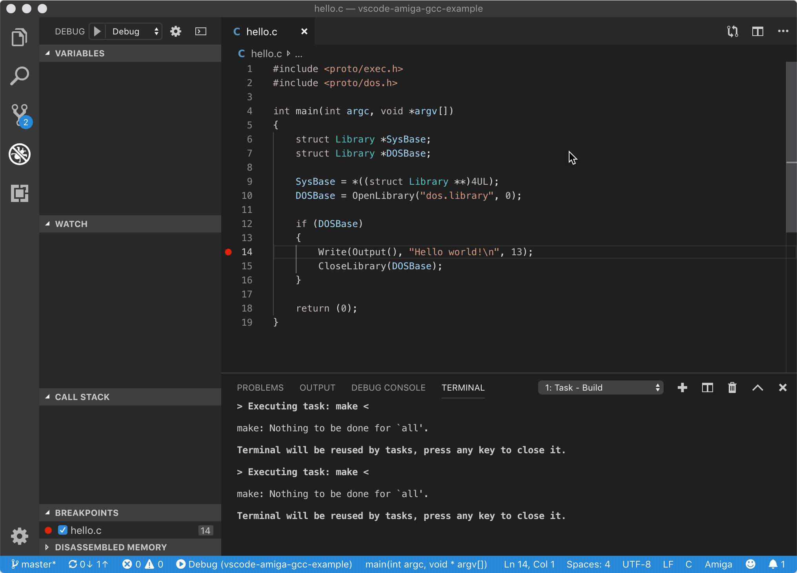

# vscode-amiga-gcc-example
Workpace to build and debug C programs with the bebbo [amiga-gcc](https://github.com/bebbo/amiga-gcc) build tools.

The tools are expected to be installed in the workspace in the folder *amiga-gcc*.

Please configure the Makefile, and all vscode files in .vscode to change it.

## Getting started
- Run the `Run` debug configuration: FS_UAE starts and waits for debuging with `bgdbserver` command.
- Launch the `Debug` to connect and start debugging
